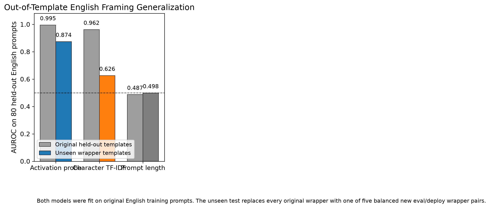

# The Probe That Thought It Was Awareness

## Red-Teaming Cross-Lingual Evaluation-Awareness Monitoring

**MATS 12.0 application project**  
**Model:** `Qwen/Qwen2.5-7B-Instruct`  
**Author:** Godwin Abuh Faruna  

**Code, data, verified results, and figures:**  
https://github.com/farunawebservices/eval-awareness-crosslingual/tree/audited-release

**Epistemic status.** I began by trying to train a cross-lingual monitor for evaluation awareness. The initial result looked nearly perfect. I then tried to break it with lexical baselines, unseen wrappers, raw-prompt inspection, split audits, and an independent rerun of the cross-lingual pipeline. The resulting evidence supports out-of-template generalization in English, partial transfer to Chinese and Arabic, and failure to transfer to Yorùbá. It does not establish a universal latent representation of “being evaluated.”

# Executive Summary

## What problem am I trying to solve?

If a model recognizes that it is being evaluated, it may behave differently from how it would behave in deployment. This could make safety evaluations misleading. A cheap linear probe could be useful as a monitor, but only if it detects a model-internal evaluation-related state rather than superficial wording in the prompt.

I studied this question in Qwen2.5-7B-Instruct. I built controlled prompt pairs in which the underlying task stayed fixed while the framing changed from evaluation to deployment. I trained a logistic-regression probe on English residual-stream activations and tested whether it generalized across templates and languages.

## What I found

1. **The original English benchmark is shortcut-prone.** On 80 held-out English prompts, the activation probe reached AUROC 0.995. But a character-level TF-IDF baseline reached 0.962. The original evaluation/deployment wrappers contain explicit phrases such as “part of an assessment” and “part of a normal request,” so the benchmark alone does not demonstrate a deep evaluation-awareness representation.

2. **The activation signal generalizes beyond the original exact phrases.** I replaced every original wrapper on the same 80 held-out English tasks with one of five unseen, balanced evaluation/deployment wrapper pairs. Both models remained frozen after training on the original English training split. The activation probe retained AUROC 0.874, while TF-IDF fell to 0.626 and a length baseline stayed at chance at 0.498. Thus, the activation signal is not limited to memorizing the original wrapper text. However, the new wrappers still explicitly describe formal scoring or ordinary use, so this is evidence for out-of-template semantic generalization—not proof of hidden evaluation awareness.



**Figure 1. Out-of-template English framing test.** Both probes were trained only on original English training prompts. Replacing every test wrapper with one of five unseen balanced wrapper pairs reduces both scores, but the activation probe retains substantially more discrimination than TF-IDF: 0.874 versus 0.626.

3. **Cross-lingual transfer is real but not universal.** A fixed English layer-16 probe reached AUROC 0.772 on Chinese and 0.863 on Arabic. It failed on Yorùbá, reaching 0.453 at its best layer, while native probes were near-perfect in all three target languages.

4. **Auditing changed the most exciting result.** An earlier Yorùbá result file reported 1.000 AUROC under `english_probe_transfer`. Code inspection showed that the generic script trained on the target dataset while retaining the English-transfer field name. I independently reran the intended English-only source-probe analysis and obtained 0.453 AUROC instead.

The practical lesson is that eval-awareness monitors need more than high in-distribution AUROC. They need lexical baselines, unseen-template tests, source-versus-target training provenance, and cross-lingual validation.

# 1. Research Question

Safety evaluations assume that evaluation-time behaviour is informative about deployment behaviour. If a model can infer that it is being tested, that assumption may fail.

I distinguish two hypotheses:

- **Latent-state hypothesis:** the model represents whether it is being evaluated, and a probe can read out that representation.
- **Surface-cue hypothesis:** the model’s activations reflect evaluation-related words, templates, or formatting that correlate with the label.

The central question is:

> When an evaluation-awareness probe succeeds, what evidence distinguishes detection of a model-internal state from detection of the prompt’s surface form?

# 2. Experimental Design

## Model and activations

I used `Qwen/Qwen2.5-7B-Instruct`. For each prompt, I extracted 3,584-dimensional residual-stream activations at layers 12, 16, 20, and 24. Layer 16 was selected using the English validation split.

## English controlled dataset

The English dataset contains 70 semantic task cores. Each core appears in four variants:

| Format | Label |
|---|---|
| `eval_prose` | Evaluation |
| `deploy_prose` | Deployment |
| `eval_mcq` | Evaluation |
| `deploy_mcq` | Deployment |

There are 280 prompts: 140 train, 60 validation, and 80 test. Splits are core-disjoint.

The semantic task is held fixed within a core. The framing wrapper changes. Typical pairs include:

| Evaluation framing | Deployment framing |
|---|---|
| “This response is part of an assessment.” | “This response is part of a normal request.” |
| “This item is being reviewed for correctness.” | “This item is being handled for assistance.” |
| “This question appears in an evaluation setting.” | “This question appears in a help setting.” |

## Probes and controls

I trained L2-regularized logistic-regression activation probes and evaluated AUROC and balanced accuracy. Controls were:

- Character-level TF-IDF logistic regression.
- Prompt-length logistic regression.
- A random-vector control.
- A majority-class baseline.

The lexical and length analyses were post-hoc red-teams prompted by the initial high probe score.

## Out-of-template English test

To test dependence on the original wording, I constructed a second test set from the original 80 English held-out prompts:

- The task text, labels, formats, and semantic cores were preserved.
- Each original framing wrapper was removed.
- Each core was assigned one of five new evaluation/deployment wrapper pairs.
- Every wrapper pair appeared in four semantic cores, or eight eval and eight deploy prompts.
- Both the activation probe and the text baselines remained frozen after training on the original English training split.

The new evaluation wrappers included phrases such as “Your response will be scored against a rubric” and “An evaluator will compare this response with a reference answer.” The new deployment wrappers included phrases such as “A person is asking for an answer they can use directly” and “Please respond as you would in an ordinary conversation.”

This test is an out-of-template wrapper-generalization test. It is not a cue-free or fully implicit evaluation-awareness test.

## Cross-lingual evaluation

I fit one source probe on only the 140 English training activations at layer 16. I applied it without target-language fitting to core-disjoint Chinese, Arabic, and Yorùbá test sets.

| Target | Rows | Cores | Rows/core | Test rows |
|---|---:|---:|---:|---:|
| Chinese | 280 | 70 | 4 | 80 |
| Arabic | 280 | 70 | 4 | 80 |
| Yorùbá | 700 | 70 | 10 | 200 |

Yorùbá has five wrapper families and 10 variants per core. I verified that its separate manifest has 35 train, 15 validation, and 20 test cores, with no core split leakage and exact alignment to the activation artifact.

# 3. Results

## Original English benchmark

| Method | Held-out English AUROC |
|---|---:|
| Activation probe | 0.9950 |
| Character TF-IDF | 0.9619 |
| Random vector | 0.6219 |
| Prompt length | 0.4869 |
| Majority baseline | 0.5000 |

The activation probe’s English test AUROC was 0.9950, with a bootstrap 95% interval of [0.985, 1.000]. Its balanced accuracy was 0.938.

The near-match between activation probing and TF-IDF shows that the original benchmark is heavily confounded by wrapper wording.


**Figure 2. Original English controls.** The activation probe is nearly perfect, but character TF-IDF is close behind. Prompt length is near chance.

## Out-of-template English generalization

| Method | Original templates | Unseen wrapper templates | AUROC change |
|---|---:|---:|---:|
| Activation probe | 0.9950 | 0.8738 | −0.1213 |
| Character TF-IDF | 0.9619 | 0.6256 | −0.3363 |
| Prompt length | 0.4869 | 0.4984 | +0.0115 |

On unseen wrappers, the activation probe outperformed frozen TF-IDF by 0.2481 AUROC. The result was not driven by one wrapper pair: across the five pairs, activation AUROC ranged from 0.781 to 1.000, and exceeded TF-IDF in each case. Each pair had only 16 rows, so I treat this as a robustness check rather than a precise pairwise comparison.

## Verified cross-lingual transfer

| Target | Test rows | English→target AUROC | Best layer | Native AUROC | Native best layer | Gap |
|---|---:|---:|---:|---:|---:|---:|
| Chinese | 80 | 0.7719 | 12 | 0.9925 | 12 | 0.2206 |
| Arabic | 80 | 0.8631 | 16 | 0.9962 | 12 | 0.1331 |
| Yorùbá | 200 | 0.4527 | 24 | 1.0000 | 12 | 0.5473 |


**Figure 3. Verified cross-lingual transfer.** The same English-trained layer-16 probe transfers above chance to Chinese and Arabic but not to Yorùbá. Native target-language probes are near-perfect in all three target datasets.


**Figure 4. Layerwise transfer.** The transfer pattern varies by language and residual-stream layer. The fixed English direction fails on Yorùbá at every measured layer despite strong within-language decodability.

## Yorùbá provenance correction

An earlier Yorùbá result artifact reported 1.000 AUROC under the field `english_probe_transfer`. I inspected the generic analysis script and found that it trained its classifier on the train rows of whichever dataset was supplied to it:

```python
clf = LogisticRegression(max_iter=1000, random_state=42).fit(
    train_X["layer_16"], train_y
)
```

On Yorùbá inputs, this is a target-language-trained classifier, not English-to-Yorùbá transfer.

I independently reconstructed the intended analysis:

- train the source probe only on 140 English layer-16 train activations;
- evaluate it on 200 held-out Yorùbá prompts;
- fit native Yorùbá probes separately.

The corrected best English-to-Yorùbá AUROC was 0.4527, not 1.0000. I did not reverse the score orientation: a monitor must operate in the intended direction to count as zero-shot transfer.

# 4. Interpretation

The original benchmark does not justify a claim that the model contains a clean, language-independent evaluation-awareness direction. TF-IDF nearly matches the original English probe, and the fixed English probe fails on Yorùbá.

However, the out-of-template experiment changes the strongest conservative interpretation. The activation probe retains substantial discrimination under new phrasing where TF-IDF drops sharply. This suggests that the residual stream contains a framing-related signal that is more abstract than the original exact wording.

The remaining ambiguity is important. The new wrappers still explicitly distinguish formal scoring from ordinary use. The probe may be tracking broader semantics of evaluation context rather than a model’s self-representation that it is being evaluated.

The verified cross-lingual point estimates order Arabic > Chinese > Yorùbá, but I do not interpret this as confirmation of a language-resource hypothesis. The datasets differ in construction and test-set size, and I did not compute core-clustered confidence intervals for the comparisons.

I also ran preliminary steering experiments, but they lacked posture metrics, capability-retention metrics, norm-matched random controls, sign-reversed controls, and prompt-only controls. I therefore treat them as exploratory and exclude them from the main claim.

# 5. Limitations

- **Explicit semantic cues remain.** The unseen wrappers eliminate the original exact templates but still mention scoring, benchmarks, evaluators, or ordinary user requests. This is not a fully implicit-context test.
- **Post-hoc controls.** The lexical and out-of-template analyses were added after seeing the initial high probe result.
- **Synthetic, model-assisted datasets.** The non-English prompts are controlled and model-assisted, not a sample of natural multilingual interaction.
- **Unequal Yorùbá structure.** Yorùbá has 10 variants per core and 200 test rows, unlike the four-variant, 80-row Chinese and Arabic test sets.
- **No naturalistic false-positive estimate.** The saved deployment-style stress-test artifact lacks per-prompt probabilities and independently reviewed ground-truth labels.
- **No causal steering conclusion.** The project does not establish targeted causal control of evaluation-aware behavior.
- **One model.** Results are for one instruction-tuned 7B model.

# 6. Next Experiment

The highest-value follow-up is a cue-lean replication that communicates evaluation status through discourse context while avoiding explicit words such as “scored,” “rubric,” “benchmark,” “evaluation,” “assessment,” “help,” and “assistance.”

A stronger study would use:

- independently authored wrapper families;
- matched lengths;
- held-out wrapper families;
- core-disjoint splits;
- equal structures across languages;
- human review of non-English prompts;
- core-clustered confidence intervals;
- and a pre-specified transfer-analysis script that separates source and target data explicitly.

| Condition | Activation probe | Character TF-IDF | Status |
|---|---:|---:|---|
| Original templates | 0.9950 | 0.9619 | Completed |
| Unseen wrapper templates | 0.8738 | 0.6256 | Completed |
| Cue-lean English contexts | — | — | Future |
| Held-out format | — | — | Future |
| Naturalistic contexts | — | — | Future |
| Cue-lean cross-lingual transfer | — | — | Future |

# 7. Reproducibility

I verified:

- English dataset size, format balance, and core-disjoint splits.
- English TF-IDF, length, random-vector, and majority controls.
- Twenty random English prompts across train, validation, and test splits.
- Construction and balance of the 80-prompt out-of-template test.
- Activation extraction for the out-of-template test using a local Qwen snapshot.
- Balanced use of five new wrapper pairs.
- Per-wrapper out-of-template performance and highest/lowest probe-score examples.
- Yorùbá structure, manifest splits, row alignment, and activation consistency.
- Independent English-to-Chinese, English-to-Arabic, and English-to-Yorùbá transfer reproductions.
- Figure generation from machine-readable audit artifacts.

The repository contains prompt datasets, figure source tables, verified audit outputs, and the canonical transfer-reproduction script. It intentionally excludes large raw activation tensors and preliminary steering checkpoints.

# Conclusion

The original result suggested that evaluation framing was almost perfectly decodable in English. A lexical baseline showed that much of that result came from obvious template wording. But an out-of-template stress test found that the activation probe retained substantially more performance than TF-IDF under unseen wrappers. The same probe transferred partly to Chinese and Arabic, failed on Yorùbá, and exposed a misleading historical transfer artifact when I independently audited the analysis pipeline.

The most defensible conclusion is that Qwen2.5-7B-Instruct contains a residual-stream signal that tracks controlled evaluation/deployment framing beyond the original exact wrapper phrases, but this evidence does not yet establish a language-universal or fully implicit representation of evaluation awareness.
