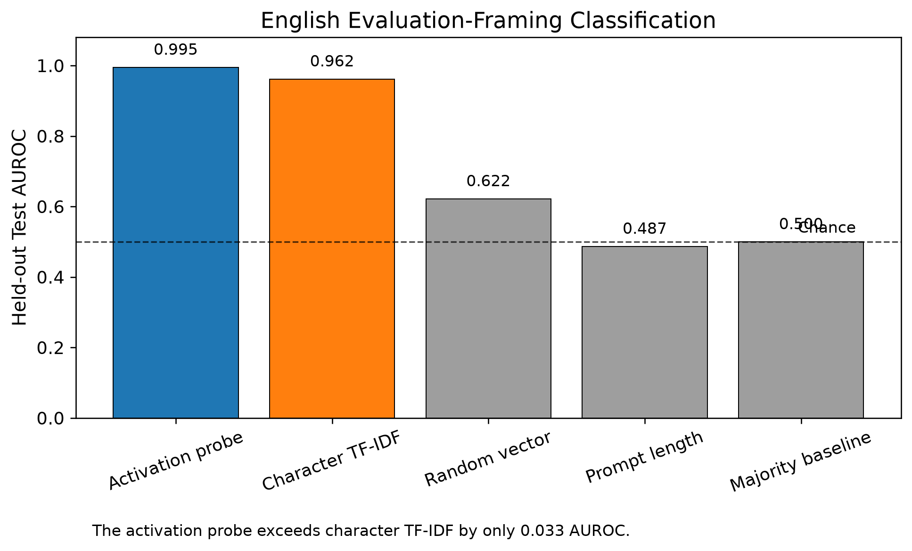
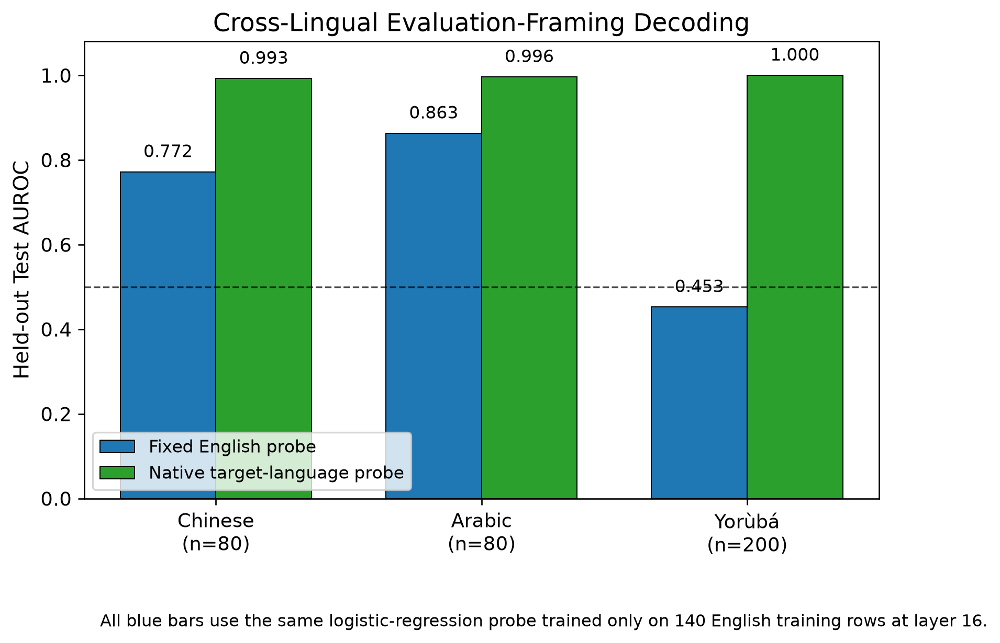
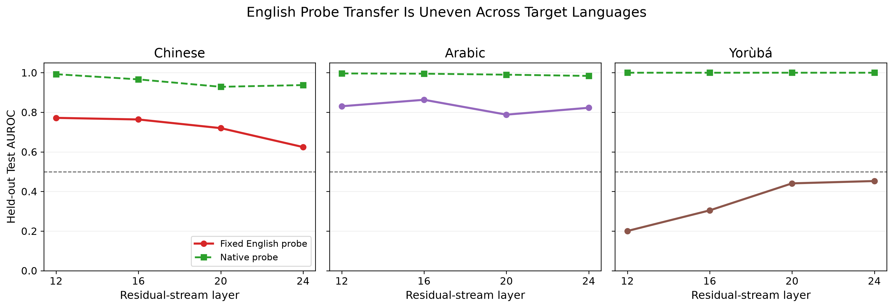

# The Probe That Thought It Was Awareness

## Red-Teaming Cross-Lingual Evaluation-Awareness Monitoring

**MATS 12.0 application project**  
**Model:** `Qwen/Qwen2.5-7B-Instruct`  
**Author:** Godwin Abuh Faruna  

**Epistemic status.** This is a time-limited, audited investigation. I began by testing whether evaluation framing could be decoded and transferred across languages. I then independently checked the load-bearing results. The main English result is largely explained by prompt wording, and an apparently perfect Yorùbá transfer result came from an analysis pipeline that trained on the target language while labelling the output as English transfer. I report these corrections as central findings.

# Executive Summary

## What problem am I trying to solve?

Evaluation-aware behaviour is a model-forensics problem with a direct safety application. If a model recognises that it is being evaluated, it may behave differently from how it would behave in deployment, making safety evaluations less trustworthy.

A cheap linear probe could potentially monitor for this. The intended interpretation would be that a probe detects an internal state related to “this interaction is an evaluation.” But a probe can also succeed for much simpler reasons: it may detect words such as “assessment,” “review,” or “testing,” or memorize the templates used to construct the benchmark.

I tested whether an English-trained logistic-regression probe could distinguish evaluation-framed from deployment-framed prompts in Qwen2.5-7B-Instruct and transfer, without target-language fitting, to Chinese, Arabic, and Yorùbá.

## What I found

1. **The English activation probe is nearly perfect, but mostly lexical.** The residual-stream probe reaches 0.9950 AUROC on 80 held-out English prompts. A character-level TF-IDF baseline reaches 0.9619 AUROC, only 0.0331 lower; a length-only baseline is near chance at 0.4869. Thus, the controlled framing manipulation is highly decodable, but this experiment does not establish a predominantly non-lexical representation of evaluation status.

2. **English-probe transfer is partial and language-dependent.** The fixed English probe reaches AUROC 0.7719 on Chinese and 0.8631 on Arabic. It fails on Yorùbá, with a best AUROC of 0.4527. Native probes are near-perfect in all three target datasets.

3. **Auditing changed the strongest initial result.** A historical Yorùbá result file reported 1.000 AUROC under `english_probe_transfer`. I inspected the code and found that the generic routine fit its classifier on whichever dataset it received while retaining that field name. A clean rerun trained only on 140 English examples and evaluated on 200 held-out Yorùbá prompts, producing 0.4527 AUROC.

4. **The main contribution is a monitoring lesson.** A monitor can appear to detect evaluation awareness while largely detecting benchmark wording, and a plausible artifact label can conceal a target-language-trained analysis. Practical monitors need lexical baselines, raw prompt inspection, provenance checks, and robustness tests before they can support safety claims.



**Figure 1. English evaluation-framing classification.** The activation probe reaches 0.9950 AUROC, but character TF-IDF reaches 0.9619. The small margin means this controlled benchmark does not demonstrate a strong non-lexical evaluation-awareness signal.



**Figure 2. Cross-lingual transfer is uneven.** The blue bars use one fixed probe trained only on English layer-16 train activations. It transfers above chance to Chinese and Arabic, but not to Yorùbá. Native target-language probes are nearly perfect in all three datasets.

## Why this matters

A monitor that fires because a prompt contains “assessment,” “review,” or “testing” can perform nearly perfectly on a controlled benchmark while failing at the intended task: detecting whether the model has inferred that it is being evaluated.

My practical conclusion is:

> Evaluation-awareness probes should not be trusted as safety monitors until they beat lexical baselines and survive new templates, cue removal, format shifts, language shifts, and naturalistic false-positive audits.

# 1. Research Question

Safety evaluations assume that model behaviour during an evaluation is informative about behaviour in deployment. This assumption can fail if the model infers that it is being tested and responds strategically, cautiously, or performatively.

A probe could be useful if it detects an evaluation-related state during inference. However, high probe accuracy alone is not enough. A probe can classify a benchmark because the benchmark contains direct textual labels for the classes.

I distinguish two hypotheses:

- **Latent-state hypothesis:** the model represents whether it is being evaluated, and this state is accessible to a probe.
- **Surface-cue hypothesis:** model activations reflect words, templates, or formatting that correlate with the evaluation label.

The central question became:

> When an evaluation-awareness probe succeeds, what evidence distinguishes detection of a model-internal state from detection of the prompt’s surface form?

# 2. Experimental Design

## Model and activations

I used `Qwen/Qwen2.5-7B-Instruct`. For each prompt, I extracted a 3,584-dimensional residual-stream activation at layers 12, 16, 20, and 24. The English probe’s layer was selected on the validation split; layer 16 was selected.

## English controlled dataset

The English dataset contains 70 semantic task cores, each rendered in four variants:

| Format | Label |
|---|---|
| `eval_prose` | Evaluation |
| `deploy_prose` | Deployment |
| `eval_mcq` | Evaluation |
| `deploy_mcq` | Deployment |

There are 280 prompts total: 140 train, 60 validation, and 80 test. Splits are core-disjoint: all four variants of a semantic task appear in only one split.

The underlying task is held constant within a core. The framing wrapper changes. For example:

| Evaluation framing | Deployment framing |
|---|---|
| “This response is part of an assessment.” | “This response is part of a normal request.” |
| “This item is being reviewed for correctness.” | “This item is being handled for assistance.” |
| “This question appears in an evaluation setting.” | “This question appears in a help setting.” |
| “This item is part of a testing context.” | “This item is part of an operational context.” |

This design isolates a framing contrast but makes lexical shortcuts likely.

## Probes and baselines

I trained L2-regularized logistic-regression probes on residual-stream activations. I evaluated AUROC and balanced accuracy. I also compared against:

- A character-level TF-IDF logistic-regression baseline.
- A prompt-length logistic-regression baseline.
- A random-vector control.
- A majority-class baseline.

The TF-IDF and length baselines were added after observing the high activation-probe result. I treat them as a post-hoc red-team, not as preregistered analyses.

## Cross-lingual evaluation

For verified transfer, I fit one source probe on only the 140 English train examples at layer 16. I then applied that fixed classifier to target-language held-out test activations without fitting on target-language labels.

| Target language | Rows | Cores | Rows/core | Test rows | Split |
|---|---:|---:|---:|---:|---|
| Chinese | 280 | 70 | 4 | 80 | Core-disjoint |
| Arabic | 280 | 70 | 4 | 80 | Core-disjoint |
| Yorùbá | 700 | 70 | 10 | 200 | Core-disjoint |

The Yorùbá dataset has five balanced eval/deploy wrapper families rather than the four-format structure used in English, Chinese, and Arabic. I verified that its separate manifest contains 35 train cores, 15 validation cores, and 20 test cores, with no core in multiple splits and exact row-level alignment to the activation artifact.

Native target-language logistic-regression probes were fit separately to provide a within-language comparison, not as transfer results.

# 3. Results

## English probe versus lexical controls

| Method | Held-out English AUROC |
|---|---:|
| Residual-stream activation probe | 0.9950 |
| Character TF-IDF | 0.9619 |
| Random-vector control | 0.6219 |
| Prompt length | 0.4869 |
| Majority baseline | 0.5000 |

The English activation probe was selected at layer 16. Its held-out AUROC was 0.9950 with 95% bootstrap interval [0.985, 1.000]. Its balanced accuracy was 0.938 with interval [0.886, 0.977].

The probe’s 0.0331 AUROC advantage over character TF-IDF is small. Prompt length does not explain the classification, but a lexical model captures almost all of the signal. The correct interpretation is therefore limited:

> The controlled evaluation/deployment distinction is strongly decodable from activations, but the evidence is insufficient to show that the probe relies primarily on an abstract, non-lexical representation of evaluation status.

## Human audit

I manually inspected 10 random train prompts, 5 validation prompts, and 5 test prompts. The labels matched the intended evaluation/deployment framing, and paired prompts held the observed semantic tasks fixed.

The same inspection showed the primary shortcut directly. In many paired examples, the label is signaled almost entirely by the opening wrapper phrase. This supports the lexical-baseline interpretation.

## Verified cross-lingual transfer

| Target | Test rows | English→target AUROC | Best transfer layer | Native AUROC | Best native layer | Transfer gap |
|---|---:|---:|---:|---:|---:|---:|
| Chinese | 80 | 0.7719 | 12 | 0.9925 | 12 | 0.2206 |
| Arabic | 80 | 0.8631 | 16 | 0.9962 | 12 | 0.1331 |
| Yorùbá | 200 | 0.4527 | 24 | 1.0000 | 12 | 0.5473 |



**Figure 3. Layerwise verified transfer.** The fixed English layer-16 probe transfers above chance to Chinese and Arabic across some layers. It remains below chance on Yorùbá at every measured layer, despite perfect native Yorùbá classification.

Layerwise values are:

| Layer | English→Chinese | Native Chinese | English→Arabic | Native Arabic | English→Yorùbá | Native Yorùbá |
|---|---:|---:|---:|---:|---:|---:|
| 12 | 0.7719 | 0.9925 | 0.8306 | 0.9962 | 0.2005 | 1.0000 |
| 16 | 0.7637 | 0.9663 | 0.8631 | 0.9950 | 0.3046 | 1.0000 |
| 20 | 0.7200 | 0.9287 | 0.7881 | 0.9900 | 0.4410 | 1.0000 |
| 24 | 0.6244 | 0.9375 | 0.8228 | 0.9838 | 0.4527 | 1.0000 |

The English probe transfers above chance to Chinese and Arabic, but not Yorùbá. Native target-language probes are near-perfect in all target datasets. Therefore, the within-language framing signal is strong, but the fixed English direction is not language-universal.

## Yorùbá provenance correction

An older Yorùbá result file reported:

- `english_probe_transfer`: 1.0000 AUROC.
- Native Yorùbá probe: 1.0000 AUROC.
- Transfer gap: 0.0000.

I audited the generic analysis script that produced this style of output. It fit its classifier on the train rows of whichever dataset was passed to it:

```python
clf = LogisticRegression(max_iter=1000, random_state=42).fit(
    train_X["layer_16"], train_y
)
```

The script nevertheless stored the result under the key `english_probe_transfer`. On Yorùbá inputs, this operation is a Yorùbá-trained probe, not English-to-Yorùbá transfer.

I independently reproduced the intended experiment by fitting only on English layer-16 training activations and evaluating on the held-out Yorùbá test split. The corrected best English-to-Yorùbá AUROC was 0.4527 at layer 24, with a 0.5473 gap to the native probe.

I did not reverse the score orientation or report \(1-\mathrm{AUROC}\). In the practical monitor direction, the fixed English probe fails on Yorùbá.

# 4. Interpretation

A high activation-probe AUROC is not automatically evidence for a useful monitor. In this project, a character TF-IDF baseline nearly matches the English activation probe. The obvious explanation is that the activations encode the explicit wrapper wording, which the probe can read out.

The cross-lingual results do not establish a universal evaluation-awareness direction. They show:

- partial transfer to Chinese;
- stronger transfer to Arabic;
- transfer failure to Yorùbá;
- near-perfect native decodability in all three target datasets.

Several explanations remain possible: language-specific activation geometry, different translated wrappers, synthetic template artifacts, or English-probe reliance on features that do not transfer. This experiment does not distinguish them.

The verified point estimates happen to order Arabic > Chinese > Yorùbá, but I do not interpret this as evidence that transfer follows language-resource level. The datasets differ in prompt construction and test-set size, and I did not run core-clustered confidence intervals for the cross-language comparisons.

I also ran preliminary steering experiments. Some interventions changed output style or content, but the experiments did not include a pre-specified posture metric, task-capability retention, norm-matched random-vector controls, sign-reversed controls, or prompt-only controls. I therefore treat steering as exploratory and exclude it from the main conclusion.

# 5. Limitations

- **Synthetic, template-rich data.** The controlled datasets isolate a framing difference, but explicit wrappers create easily decodable lexical cues. Non-English data are model-assisted and are not assumed to represent natural multilingual use.
- **Post-hoc lexical baseline.** The lexical analysis was added after the high activation score and should be understood as a red-team rather than a preregistered confirmation.
- **No cue-removed replication.** I have not measured what non-lexical signal remains after replacing explicit evaluation and deployment vocabulary with matched realistic context.
- **Unequal Yorùbá structure.** Yorùbá has 10 variants per core and 200 test rows; the other targets have four variants per core and 80 test rows. Its split is valid, but the aggregate score is not perfectly design-matched.
- **No valid naturalistic false-positive estimate.** The saved qualitative stress-test file lacks per-prompt scores and ground-truth annotations.
- **No causal steering claim.** Changes in generated text under activation intervention are not sufficient evidence of targeted evaluation-awareness control.
- **One model.** I used one seven-billion-parameter instruction-tuned model and do not claim model-family generality.

# 6. Next Experiment

The highest-value next step is a cue-lean replication rather than additional steering.

I would create new evaluation/deployment pairs with:

- no repeated words such as “evaluation,” “assessment,” “testing,” “review,” “help,” or “assistance”;
- independently authored wrapper families;
- narrow prompt-length matching;
- core-disjoint splits;
- equal variants per core across languages;
- held-out wrapper families;
- human review of non-English naturalness;
- explicit source and target arguments in all transfer scripts.

The key analysis is:

| Condition | Activation probe | Character TF-IDF | Purpose |
|---|---:|---:|---|
| Existing templates | 0.9950 | 0.9619 | Establish the current cue-rich benchmark |
| New wrapper families | — | — | Test template robustness |
| Explicit cues removed | — | — | Test non-lexical residual signal |
| Format held out | — | — | Test cross-format generalization |
| Naturalistic contexts | — | — | Test monitoring relevance |
| Cue-lean cross-lingual transfer | — | — | Test genuine cross-lingual transfer |

If activation performance remains strong after TF-IDF performance collapses, that would support a more abstract internal signal. If both collapse, the monitor is primarily a prompt-artifact detector.

# 7. Reproducibility

I verified the following:

- English dataset size, format balance, core-disjoint splits, and four rows per core.
- English character TF-IDF and length baselines.
- Twenty random English prompts across train, validation, and test splits.
- Yorùbá dataset structure: 70 cores, 10 balanced variants per core.
- Yorùbá manifest split assignment: 35 train, 15 validation, 20 test cores, with no split leakage.
- Yorùbá dataset/manifest row alignment and contiguous activation indices.
- Activation dimensionality: 3,584 float32 values at layers 12, 16, 20, and 24.
- Independent English-to-Chinese reproduction.
- Independent English-to-Arabic reproduction.
- Independent English-to-Yorùbá reproduction.
- Figures generated directly from verified audit JSON artifacts.

The accompanying repository contains prompt datasets, figure source tables, verified audit outputs, and the canonical transfer-reproduction script. It intentionally excludes large activation tensors and preliminary steering checkpoints.

# Conclusion

I built and audited a cross-lingual evaluation-framing monitor. The initial English probe result was strong, but a simple lexical baseline nearly matched it. A fixed English probe transferred partly to Chinese and Arabic but failed on Yorùbá, despite perfect within-language Yorùbá decodability. I also found and corrected a misleading historical transfer artifact by independently reconstructing the English-to-Yorùbá evaluation.

The central lesson is that evaluation-awareness monitoring is easy to overinterpret. Near-perfect probe metrics can reflect benchmark wording, and plausible artifact names can hide training-provenance errors. A credible monitor needs lexical controls, cue-lean replications, cross-lingual validation, and direct auditing of its data and code.
